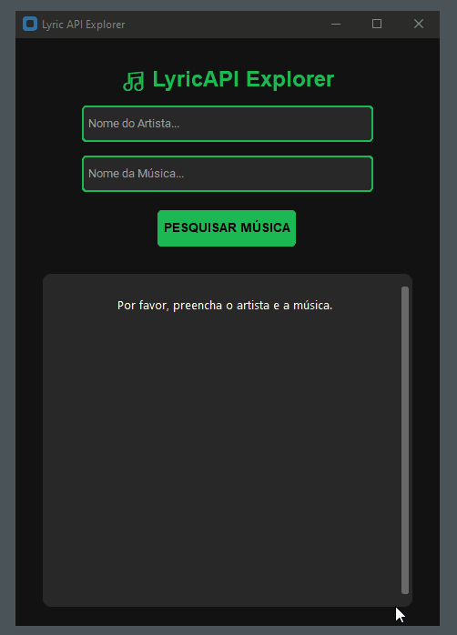

# 🎵 LyricAPI Explorer

O **LyricAPI Explorer** é uma aplicação desktop moderna desenvolvida em Python para busca e consulta de letras de músicas em tempo real através da integração com a API do Genius.



## 🚀 Recursos
* Busca inteligente combinando o nome do artista e o título da música.
* Interface gráfica otimizada com sistema de rolagem (`CTkScrollableFrame`) para leitura fluida de composições longas.
* Filtro automático que remove cabeçalhos de seções desnecessários, entregando apenas a letra limpa.

## 🛠️ Tecnologias Utilizadas
* **Python**
* **CustomTkinter** (Interface Gráfica com estética Dark Mode)
* **LyricsGenius** (Biblioteca cliente para integração com a API)
* **Python-dotenv** (Gerenciamento seguro de credenciais locais)

---

## 🔒 Configuração de Segurança e Credenciais

O projeto foi construído seguindo boas práticas de segurança, mantendo os tokens de acesso isolados do código-fonte público.

1. Crie uma conta gratuita no portal de desenvolvedores do [Genius](https://genius.com/developers).
2. Gere um *Client Access Token*.
3. Na raiz do projeto, duplique o arquivo `.env.example`, renomeie para `.env` e adicione o seu token:

```text
GENIUS_TOKEN=seu_token_genius_aqui
